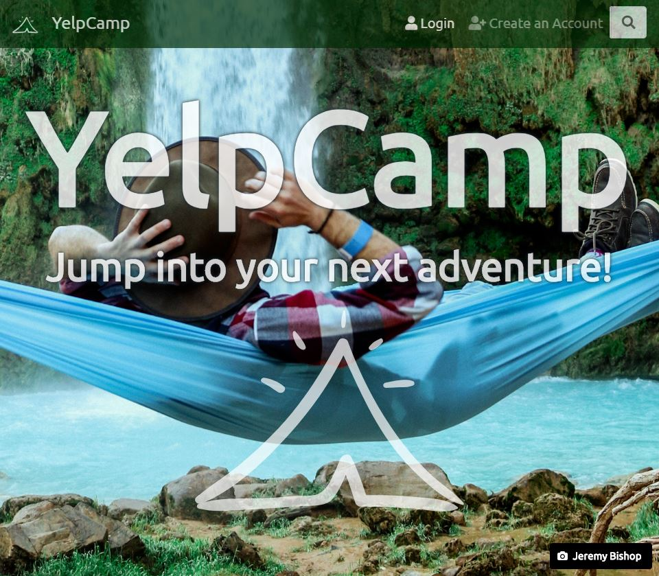

# Introduction

*YelpCampDeployment* is a refactored version of the yelpCamp project developed under the instruction of [Colt Steele](https://www.udemy.com/the-web-developer-bootcamp/), with a shoutout to Ian Schoonover and Zarko Maslaric. The project is my first fully deployed fullstack app, and is not intended for heavy use. It allows a user to accomplish the following:

  * browse campgrounds and registered users
    - no login required
  * search (fuzzy) for campgrounds and registered users
    - no login required
  * create and manage a yelpCamp profile
    - edit profile info
    - reset forgotten password via registered email
    - delete profile
  * create and manage campgrounds
    - must be signed in to a yelpCamp profile
    - post a campground
    - edit posted campground info
    - delete posted campground
  * comment on any posted campground
    - must be signed in to a yelpCamp profile
    - edit one's own posts
    - delet one's own posts
  * edit/delete other user content
    - must have administrative privileges

See the live version here: [https://evening-everglades-41057.herokuapp.com](https://evening-everglades-41057.herokuapp.com). Feel free to experiment with it, and please reach out to me if bugs are found.

# Select Packages and Features
<table style="padding: 0;">
  <tr style="padding: 0">
    <td style="padding: 0 20px 0 0"></td>
    <td style="padding: 0">
For all installed packages see `package.json`. For further explanation see the relevant dev notes in each route for the package in question.

  * `express` and `mongoose` for RESTful and CRUD strategies
  * `passport` for local authentication/authorization
  * `connect-flash` for front-end error handling
  * `ejs` for templating
  * `node-geocoder` for implementing Google Maps APIs
  * `cloudinary` for hosting and moderating user uploaded images
  * [mLab](https://mlab.com/) for hosting a persistent MongoDB database
  * [Heroku](https://www.heroku.com/home) for app deployment
    </td>
  </tr>
</table>

# Functional Summary
<table>
  <tr style="padding: 0">
    <td style="padding: 0 5px 0 0" width="68%"></td>
    <td style="padding-left: 0 0 0 5px" width="33%"></td>
  </tr>
</table>

## Campground and User Show Pages
<table>
  <tr style="padding: 0">
    <td style="padding-right: 5px" width="33%"></td>
    <td style="padding-right: 5px" width="33%"></td>
    <td>
The show page for each campground boasts a fully interactive map via the Google API. On loggin in users can create campgrounds and contributed comments. Options for editing or deleting the campground and/or comments appear if the logged-in user posted them.

The show page for each user is similar but simpler, with the authorization functionality for editing and deleting also present.
    </td>
  </tr>
</table>

## Search Results
<table>
  <tr style="padding: 0">
    <td style="padding-right: 5px" width="33%"></td>
    <td>
The search feature is currently limited to campground names and usernames. Like the index pages for all campgrounds and all users, search results are displayed in paginated format. The default number of displayed search results can be adjusted in the `search.js` route by modifying the `perPage` variable. The same holds true for the campgrounds and users index pages via the `campgrounds.js` and `users.js`, routes, respectively.
    </td>
  </tr>
</table>

## Administration
<table>
  <tr style="padding: 0">
    <td style="padding-right: 5px" width="33%"></td>
    <td>
Administration is built into the user profile on the database side, where all registered users are `{isAdmin: false}` by default. This is where I departed from the course, leaving the option for `{isAdmin: true}` up to the sole discretion of the one having database permissions to do so. That is, it cannot be accessed through the front-end, but in the current version must be human-moderated. If a user profile is granted administrative authorization, they have the ability to edit or delete any other user profile, campground, and comment.

All images uploaded by registered users are filtered through Cloudinary's moderation tools: WebPurify for human moderation; aws Rekognition for AI moderation. Both are fast, and allow uploaded images to appear right away (presuming their appropriateness).
    </td>
  </tr>
</table>