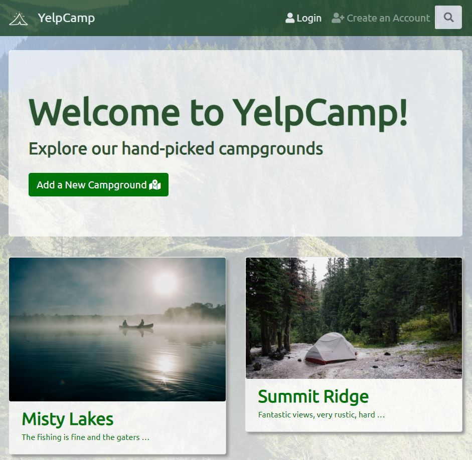

# Introduction

*YelpCampDeployment* is a refactored version of the yelpCamp project developed under the instruction of [Colt Steele](https://www.udemy.com/the-web-developer-bootcamp/), with a shoutout to Ian Schoonover and Zarko Maslaric. The project is my first fully deployed fullstack app, and is not intended for heavy use. It allows a user to accomplish the following:

  * browse campgrounds and registered users
    - no login required
  * search (fuzzy) for campgrounds and registered users
    - no login required
  * create and manage a yelpCamp profile
    - edit profile info
    - reset forgotten password via registered email
    - delete profile
  * create and manage campgrounds
    - must be signed in to a yelpCamp profile
    - post a campground
    - edit posted campground info
    - delete posted campground
  * comment on any posted campground
    - must be signed in to a yelpCamp profile
    - edit one's own posts
    - delet one's own posts
  * edit/delete other user content
    - must have administrative privileges

See the live version here: [https://evening-everglades-41057.herokuapp.com](https://evening-everglades-41057.herokuapp.com).

# Select Packages and Features

For all installed packages see `package.json`. For further explanation see the relevant dev notes in each route for the package in question.

  * `express` and `mongoose` for RESTful and CRUD strategies
  * `passport` for local authentication/authorization
  * `connect-flash` for front-end error handling
  * `ejs` for templating
  * `node-geocoder` for implementing Google Maps APIs
  * `cloudinary` for hosting and moderating user uploaded images
  * [mLab](https://mlab.com/) for hosting a persistent MongoDB database
  * [Heroku](https://www.heroku.com/home) for app deployment

# Functional Summary

## 

